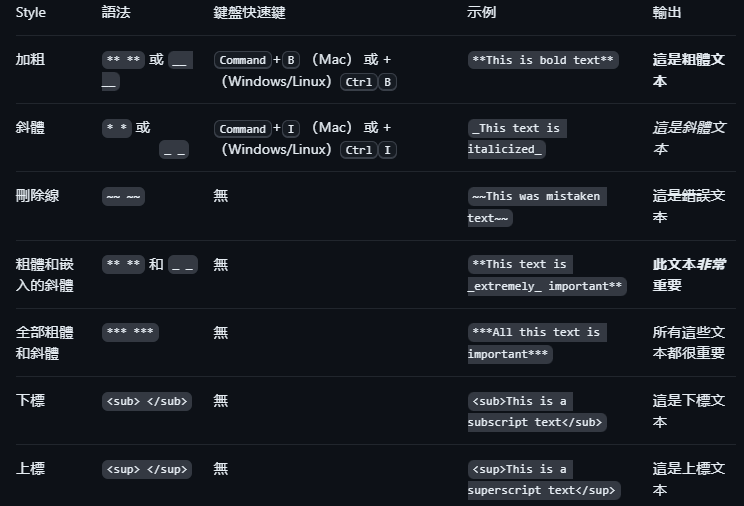

# Markdown 撰寫

## 標題
要創建標題，請在標題文本前添加一至六個 符號。 你使用的 數量將決定層次結構級別和標題的大小。`#` `#`
 - # 我是標題
 - ## 我是標題
 - ### 我是標題
 - #### 我是標題

使用兩個或多個標題時，GitHub 會自動生成一個目錄，可以通過按兩下檔標題中的 來訪問該目錄。 每個標題都列在目錄中，可以按下某個標題導航到所選部分

## 文本樣式
可以在評論欄位和檔中以粗體、斜體、刪除線、下標或上標文本表示強調。`.md`

## 引用文本
可以使用 來引用文本。`>`
    
    Text that is not a quote

    > Text that is a quote
    
- 參考資料：[基本撰寫和格式語法] <https://docs.github.com/zh/get-started/writing-on-github/getting-started-with-writing-and-formatting-on-github/basic-writing-and-formatting-syntax#styling-text\>
