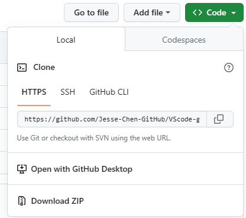

# VScode-github
新手測試

在 Github 上新增 repository

建立 `VScode-github`

1. Open with GitHub Desktop
   - 安裝桌面
   
   

2. Install Git
   - 依畫面指示操作安裝

3. 開啟目錄檔案
   - 編輯此檔

# 在本地 (本機) 使用 Git 版本控管工具

1. 在你要下載的 repository 會找到一個網址，確定是 HTTPS 不是 SSH 後，按旁邊的剪貼簿將網址複製起來。
   

2. 將 terminal 或 Git Bash 打開，進入要下載的位置：

   `git clone 貼上剛複製的網址`

3. 在 clone 下來的資料夾內輸入使用者資料：

   `git config user.name "user-ID"`
   `git config user.email "user-email"`


4. 用 VS Code 開啟資料夾
   可以看到完整的將網路上的專案複製下來了

   - 參考資料 https://jimmylab.wordpress.com/gp1015/git-github/vscode-github/


## 常用指令
   - 取得 Git 指令列工具版本
      
      `git --version`

   - 使用命令來刪除 Git 倉庫。
      
      `git rm -rf .git`

## git config --list 指令
   git config --list 指令可用於列出當前 Git 倉庫的所有設定。這些設定可用於控制 Git 的行為，例如使用者的名稱和電子郵件地址、倉庫的位置和格式、Git 使用的工具等。

   git config --list 指令會列出所有設定，包括全域設定和倉庫設定。全域設定適用於所有 Git 倉庫，而倉庫設定僅適用於目前的 Git 倉庫。

   - git config --list 指令的輸出類似以下：
      ```r {text}
      user.name = John Doe
      user.email = john.doe@example.com
      core.editor = vi
      core.pager = less
      ```
   - 您可以使用 git config --get 指令來取得特定設定的值。例如，要取得使用者的名稱，您可以使用以下命令：
  
      `git config --get user.name`

   - git config --get 指令的輸出類似以下：
      
      `John Doe`

   - 您也可以使用 git config --set 指令來設定新的設定或修改現有的設定。例如，要設定使用者的名稱為「Jane Doe」，您可以使用以下命令：
      
      `git config --set user.name Jane Doe`

   - git config --set 指令的輸出類似以下：
      
      `user.name = Jane Doe`


## 如何清除 gui.recentrepo
例如：要清除 gui.recentrepo=C:/Users/chen/z_Notes/z_MD 變數，並保留其他 gui.recentrepo 變數，您可以使用以下步驟：

1. 開啟終端機。
2. 輸入以下命令：
   
   `git config --global gui.recentrepo --unset C:/Users/chen/z_Notes/z_MD`
   
3. 按下 Enter 鍵。
   
   此命令將清除 gui.recentrepo=C:/Users/chen/z_Notes/z_MD 變數，並在下次啟動 Git 時只會列出其他最近使用的倉庫。