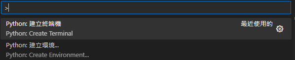

# Visual Studio Code

安裝：Microsoft Store

---

## 安裝模組

1. Chinese (Traditional) Language
   1) 安裝完，重新啟動
   2) 語系切換：命令選擇區 > display language

2. ChatGPT
3. Markdown
   1) Markdown All in One
   2) Markdown Preview Enhanced
4. vscode-icons
5. Python
6. Python extension for Visual Studio Code
7. WSL (Home install)

---

## Python

### 1. 建立虛擬環境與安裝 Library

- 參考網站：<https://pythonviz.com/basic/visual-studio-code-virtual-environment-setup/>

1. 我們首先開啟 VS Code，並按一下 Cmd + Shift + P 開啟 Command Palette。輸入「terminal」，並選取「Python: Create Terminal」的選項。
   - 如在開啟的專案中，選擇「Python: Create Terminal」會進入venv 狀態
   - 在 Terminal 處輸入 `deactivate` 可停用虛擬環境

    

2. 在 Terminal 輸入以下指令，在虛擬環境安裝 pandas 和  plotly：
        
        `pip install pandas plotly`

3. 這指令讓我們可以列舉全部在這個虛擬環境下已經安裝的 Python libraries
       
       `pip freeze`

### 2. 重置或移除虛擬環境

1. 其實我們只要直接移除虛擬環境的檔案夾（例如 .venv）便可以。我們在 Python Terminal 輸入以下指令：
        
        `rm -rf .venv`

### 3. 版面介紹、管理 Python 專案和多個 .py

- 參考網站：<https://pythonviz.com/basic/visual-studio-code-introduction-manage-python-script/>

1. 在 Python Terminal 運行 main.py
        
        `python main.py`

2. 我們先把 script1.py 的第 5 至 6 行改成以下的代碼

    ```ruby{.line-numbers}
    if __name__ == '__main__':
        writeMessage('This is called from script1.py')
    ```

    留意這次我們執行 script1.py （上圖的「2」）時，仍會出現「This is called from script1.py」的字句讓我們測試 writeMessage() 的功能，但執行 main.py （上圖的「3」）時只會出現「This is called from main.py」。

    答案就是神奇的 `if __name__ == '__main__'`: 這一句咒語了！

    `if __name__ == '__main__'` 確保這個 if-block 裡的代碼只會在 Python 直接執行該 .py 檔案時，才會運作。否則在 Python 從其他 .py 呼叫時，便不會執行這個 if-block 裡的代碼。

    這對於我們寫出測試代碼（test script）有很大的幫助。

### 4. 讓 pip 安裝和管理 Python Libraries，結合虛擬環境

- 參考網站：<https://pythonviz.com/basic/pip-installer-visual-studio-code-usage/>

1. 在 VS Code 的 Python Terminal，使用 pip 安裝新 library 的語法是：
    
    `pip install [library1] [library2] [library3]...`

2. 安裝的 Library 與 Dependencies
    您有沒有發現我們指示 pip 安裝 pandas 與 plotly 時，pip 其實安裝了更多的 library 嗎（如上圖）？
    這些我們沒有要求 pip 安裝，但在「Installing collected package」出現的，就是所謂的 Dependencies。

    一些較為複雜的 Python library 會建基於其他更為簡單的 library，而 pip 在安裝這些複雜的 library 時會同時安裝這些簡單的 library，使您能順利使用您要求的 library。

    因此，我們縱然指示 pip 安裝 2 個 libraries，但實際上 pip 卻安裝了 7 個 library，即是 plotly 和 pandas 有 5 個 library 作它們的 dependencies 。

3. pip 功能 2：freeze、匯入和輸出 library 列表
    使用 pip freeze 輸出 requirements.txt
    我們可以在 Python Terminal 輸入以下指令，獲取在這個虛擬環境已經安裝的 Python library：
     
     `pip freeze`

4. 我們會使用到以下的代碼，在 root directory （即「vscode-example」）生成一個「requirements.txt」的檔案：
     
     `pip freeze > requirements.txt`

    我們可以見到 requirements.txt 把 pip freeze 的回傳儲存在一個 .txt 的檔案裡。這個 requirements.txt 是一個十分重要的 Python 專案組件，用於

    a) 備份我們的虛擬環境
        使用 pip 安裝新的 library 前把現有的 libraries 列表匯出到 requirements.txt，那麼如果新的 library 不兼容於我們的專案，我們可以使用 requirements.txt 還原專案

    b) 部署（deploy）專案
        把 Python 專案部署到伺服器（例如透過 Google Cloud 等服務）運作時，我們可以使用 requirements.txt 告知伺服器裡的 pip 去安裝所需的 library

5. 使用 pip install 匯入 requirements.txt
    可以使用以下指令，從 requirements.txt 還原我們的 Python libraries 安裝：
     
     `pip install -r requirements.txt`

6. pip 功能 3：更新已安裝的 library
    **因為更新後的 library 可能出現兼容問題，進行以下操作前，請先使用上面提及的方法使用 requirements.txt 備份虛擬環境的資料。**

    如果我們只想更新一個 library，那麼語法十分簡單：
    
    `pip install --upgrade [package]`

    留意當我們更新一個 Library 的時候，其實會同時把它的 dependencies 也更新至 Library 最新版的要求。

    如果是一個小型的專案，那麼應該沒什麼問題，但如果是一個大型的專案（特別是比較多 Python library）就盡量避免同時更新全部 Library，以防出現兼容性的問題。

    ~~我們可以使用以下指令更新全部在我們的虛擬環境裡的 Library：~~

    ```ruby
    pip --disable-pip-version-check list --outdated --format=json | python -c "import json, sys; print('\n'.join([x['name'] for x in json.load(sys.stdin)]))"| xargs -n1 pip install -U
    ```

    完成後，所有在您的虛擬環境裡的 Python Library 就會更新至最新版本。

    如果經測試後，這個更新對運行 Python 專案沒有影響，那麼我們便可以使用上面描述的 pip freeze > requirements.txt 刷新我們的虛擬環境設定，讓我們下次 pip install -r requirements.txt 可以安裝新的 Library 。

7. pip 功能 4：刪除現有安裝的 Python Library
    如果我們認為一個現有、已安裝的 Python Library 沒有用途，如何從我們的虛擬環境移除？
    移除的方法很簡單，我們只需要
    
    `pip uninstall [library1] [library2] ...`

    首先我們必須澄清：這個方法未必是最佳方案（best practice）。由於我們移除單一的 Python library 不會同時移除它的 dependencies，因此如果我們的目的是清理虛擬環境，這個方法並不奏效。

    以上圖為例，我們只指名移除 pandas 時，在橘色框裡 pandas 的 dependencies（numpy、python-dateutil、pytz）沒有同時被移除。

    良好的習慣是在安裝新的 Python library 前，先備份虛擬環境（即 pip freeze > requirements.txt），才安裝 Python library。那麼我們想要移除一些 Library 時，便可以透過上面提及的重設虛擬環境、匯入 requirements.txt 的方法解決我們的問題。

8. 刪除所有的 Python Library
    最快捷的方法當然是直接刪除 .venv 的檔案夾，重新設定新的 .venv （虛擬環境），那麼您就會有一個新的、空白的虛擬環境可以使用：

    ```r {.line-numbers}
    rm -rf .venv
    virtualenv .venv
    pip freeze
    ```

    從最後的 pip freeze 輸出為空白可見，我們使用這個方法就可以徹底清除所有已安裝的 Library，重新開始（fresh start）。

### 草稿
5. VSCode 5/5: Jupyter Notebook 互動編程？實在太方便了

   - 參考網站：<https://pythonviz.com/colab-jupyter/visual-studio-code-jupyter-notebook-integration/>

6. VS Code 的 Jupyter Notebook 比較進階。如果您從未接觸過 Jupyter Notebook 或 Python，可以考慮先跟從免安裝的 Google Colab Notebook（也是 Jupyter Notebook 的化身）的以下教學，學會 Python 基本技能。
        Google Colab Notebook: <https://colab.research.google.com/>
